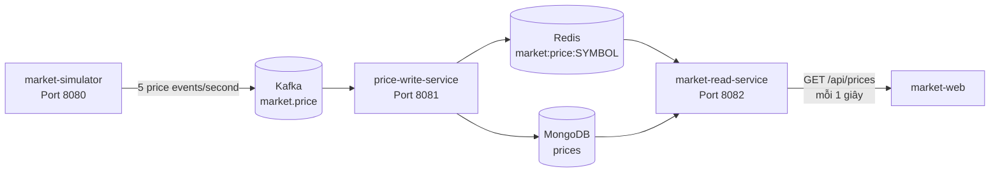

# Kế hoạch thiết kế Frontend `market-web`

## 1. Mục tiêu

Xây dựng một Web Dashboard theo phong cách bảng giá Binance/TradingView để theo dõi trực tiếp 5 cặp coin:

- `BTC/USDT`
- `ETH/USDT`
- `BNB/USDT`
- `SOL/USDT`
- `XRP/USDT`

Dashboard phải dễ quan sát, cập nhật tự động mỗi giây và thể hiện rõ hướng biến động của từng mã:

- Giá mới cao hơn giá ở lần cập nhật trước: nhấp nháy xanh.
- Giá mới thấp hơn giá ở lần cập nhật trước: nhấp nháy đỏ.
- Giá không đổi: không phát hiệu ứng.
- Hiển thị phần trăm biến động so với `initialPrice`.
- Cảnh báo khi dữ liệu cũ hoặc backend mất kết nối.

Phạm vi MVP là màn hình theo dõi thị trường, chưa bao gồm đăng nhập, đặt lệnh, ví, nạp/rút hoặc dữ liệu giao dịch thật.

## 2. Hiện trạng dự án

### 2.1. Kiến trúc đang có



- `market-simulator` sinh giá cho 5 cặp coin theo chu kỳ 1 giây và gửi vào Kafka topic `market.price`.
- `price-write-service` nhận event, ghi bản mới nhất vào MongoDB và cache Redis với TTL 30 giây.
- `market-read-service` ưu tiên đọc Redis, fallback MongoDB và cung cấp REST API.
- Chưa có frontend, cấu hình CORS, Docker Compose chung hoặc gateway ở thư mục gốc.

### 2.2. API frontend có thể sử dụng ngay

**Danh sách giá:**

```http
GET http://localhost:8082/api/prices
```

**Một cặp coin:**

```http
GET http://localhost:8082/api/prices/{base}/{quote}
```

Ví dụ dữ liệu hiện tại:

```json
{
  "symbol": "BTC/USDT",
  "initialPrice": 65000,
  "price": 65321.125000,
  "sequence": 42,
  "updateAt": "2026-10-07T03:20:15.123Z"
}
```

Ý nghĩa dùng trên giao diện:

| Trường | Cách sử dụng |
|---|---|
| `symbol` | Tên cặp giao dịch và khóa định danh của một dòng |
| `initialPrice` | Mốc tính tổng phần trăm biến động |
| `price` | Giá mới nhất |
| `sequence` | Nhận biết bản cập nhật mới, tránh chạy lại hiệu ứng với dữ liệu cũ |
| `updateAt` | Hiển thị thời gian cập nhật và phát hiện dữ liệu stale |

Phần trăm biến động trong MVP:

```text
changePercent = ((price - initialPrice) / initialPrice) * 100
```

Lưu ý: đây là biến động từ lúc simulator khởi tạo, không phải biến động 24 giờ. UI nên ghi rõ nhãn `Từ lúc khởi chạy` hoặc `Session change`, không ghi `24h` khi backend chưa cung cấp dữ liệu 24 giờ.

## 3. Quyết định công nghệ

### 3.1. Stack đề xuất

- React + TypeScript: phù hợp giao diện có nhiều trạng thái cập nhật liên tục và giúp kiểm soát kiểu dữ liệu API.
- Vite: khởi tạo và chạy môi trường phát triển nhanh.
- TanStack Query: polling mỗi giây, cache dữ liệu cuối cùng, retry có kiểm soát và quản lý trạng thái loading/error.
- Tailwind CSS: xây nhanh giao diện responsive, dark theme và các trạng thái màu nhất quán.
- Vitest + React Testing Library: unit/component test.
- Playwright: kiểm thử luồng hiển thị và hiệu ứng cập nhật ở mức trình duyệt.
- Lucide React: bộ icon nhỏ, đồng nhất; không phụ thuộc emoji để biểu đạt trạng thái quan trọng.

Không cần Redux ở MVP. Dữ liệu server do TanStack Query quản lý; lịch sử giá ngắn và trạng thái UI có thể đặt trong hook/component.

### 3.2. Cách kết nối backend

MVP dùng polling:

```text
market-web -- GET /api/prices mỗi 1000 ms --> market-read-service
```

Trong development, cấu hình Vite proxy:

```text
/api/* -> http://localhost:8082
```

Frontend chỉ gọi đường dẫn tương đối `/api/prices`. Cách này không cần mở CORS khi phát triển và dễ chuyển sang reverse proxy khi deploy.

Nếu frontend và backend được deploy ở hai origin độc lập thì bổ sung cấu hình CORS có whitelist trong `market-read-service`; không dùng `allowedOrigins("*")` cho môi trường production.

SSE/WebSocket chưa cần cho MVP. Chỉ cân nhắc ở giai đoạn sau khi số lượng mã hoặc số người dùng tăng, vì polling 1 request/giây là đủ nhẹ với 5 mã và giữ kiến trúc hiện tại đơn giản.

## 4. Thiết kế trải nghiệm và giao diện

### 4.1. Phong cách hình ảnh

- Dark theme làm mặc định, lấy cảm hứng từ terminal giao dịch nhưng không sao chép thương hiệu Binance/TradingView.
- Nền chính xám đen; panel có độ tương phản nhẹ, đường viền mảnh.
- Xanh chỉ dùng cho biến động dương/trạng thái online; đỏ cho biến động âm/lỗi; vàng cho dữ liệu chậm.
- Số giá dùng font tabular để chữ số không làm cột bị rung khi thay đổi.
- Hiệu ứng ngắn, rõ nhưng không chớp liên tục gây mỏi mắt.

Token màu gợi ý:

| Vai trò | Giá trị gợi ý |
|---|---|
| Background | `#0B0E11` |
| Panel | `#14181F` |
| Border | `#252A34` |
| Text chính | `#EAECEF` |
| Text phụ | `#848E9C` |
| Tăng | `#0ECB81` |
| Giảm | `#F6465D` |
| Cảnh báo | `#F0B90B` |

### 4.2. Bố cục desktop

```text
┌──────────────────────────────────────────────────────────────────────┐
│ MARKET PULSE                       ● LIVE     Cập nhật: 10:20:15     │
│ Theo dõi dữ liệu mô phỏng theo thời gian thực                        │
├──────────────────────────────────────────────────────────────────────┤
│ 5 cặp giao dịch │ 3 tăng │ 2 giảm │ Chu kỳ cập nhật: 1 giây         │
├──────────────────────────────────────────────────────────────────────┤
│ Thị trường                                              [Tìm kiếm]   │
│----------------------------------------------------------------------│
│ Cặp giao dịch │ Giá mới nhất │ Session change │ Xu hướng │ Cập nhật │
│ BTC / USDT    │ 65,321.12 ↑  │ +0.49%         │ ▁▂▃▅▄▆  │ vừa xong │
│ ETH / USDT    │  3,487.40 ↓  │ -0.36%         │ ▆▅▅▃▄▂  │ vừa xong │
│ ...                                                                  │
└──────────────────────────────────────────────────────────────────────┘
```

### 4.3. Responsive

- `>= 1024px`: bảng đầy đủ, có cột mini sparkline và thời gian cập nhật.
- `768–1023px`: ẩn bớt nhãn phụ, giữ đủ giá, phần trăm, xu hướng và trạng thái.
- `< 768px`: mỗi cặp coin thành một card; giá và phần trăm là thông tin ưu tiên.
- Không tạo cuộn ngang bắt buộc trên màn hình điện thoại.

### 4.4. Trạng thái giao diện bắt buộc

1. **Loading lần đầu:** hiển thị 5 skeleton row, không dùng spinner toàn màn hình.
2. **Có dữ liệu:** hiển thị bảng và trạng thái `LIVE`.
3. **Refresh lỗi tạm thời:** giữ dữ liệu cuối cùng, hiển thị banner nhỏ `Đang kết nối lại...`.
4. **Chưa có dữ liệu:** hướng dẫn kiểm tra simulator/Kafka/write-service/read-service.
5. **Dữ liệu stale:** nếu `updateAt` không tiến lên trong hơn 5 giây, đổi trạng thái mã sang vàng; trên 15 giây hiển thị đỏ `Mất dữ liệu`.
6. **Backend không truy cập được:** hiển thị lỗi có nút `Thử lại`, không làm mất dữ liệu cache đang có.

## 5. Quy tắc cập nhật giá và hiệu ứng

### 5.1. So sánh bản giá

Mỗi symbol giữ bản ghi trước đó trong `useRef` hoặc một map nội bộ:

```text
Nếu chưa có previous                   -> render lần đầu, không flash
Nếu new.sequence <= previous.sequence -> bỏ qua hiệu ứng
Nếu new.price > previous.price         -> direction = up
Nếu new.price < previous.price         -> direction = down
Nếu bằng nhau                          -> direction = unchanged
```

Sau khi xác định hướng, cập nhật bản ghi trước bằng dữ liệu mới.

### 5.2. Hiệu ứng đề xuất

- Giá tăng: nền xanh trong suốt + chữ xanh, fade về nền thường trong 600–800 ms.
- Giá giảm: nền đỏ trong suốt + chữ đỏ, fade về nền thường trong 600–800 ms.
- Mỗi animation gắn với `symbol + sequence` để cùng một response không phát lại hiệu ứng.
- Không flash toàn bộ dòng; chỉ flash ô giá để giảm nhiễu thị giác.
- Tôn trọng `prefers-reduced-motion`: tắt animation và chỉ đổi màu chữ ngắn hạn.

### 5.3. Lịch sử ngắn và sparkline

Frontend giữ tối đa 60 điểm gần nhất cho từng symbol, tương đương khoảng 1 phút dữ liệu khi polling mỗi giây. Lịch sử này chỉ tồn tại trong bộ nhớ và reset khi tải lại trang.

MVP có thể triển khai sparkline bằng SVG nhỏ để tránh thêm thư viện chart nặng. Đây là xu hướng ngắn hạn trên trình duyệt, không phải lịch sử thị trường lưu trong backend.

### 5.4. Định dạng số

- Dùng `Intl.NumberFormat`, locale có thể đặt `en-US` để quen với bảng giá tài chính.
- Số chữ số thập phân thay đổi theo mức giá, ví dụ:
  - Giá `>= 1,000`: 2 chữ số thập phân.
  - Giá `>= 1`: 2–4 chữ số thập phân.
  - Giá `< 1`: tối đa 6 chữ số thập phân.
- Luôn hiển thị dấu `+` cho phần trăm dương.
- Không chuyển giá tiền sang JavaScript `number` để tính toán nghiệp vụ phức tạp trong tương lai; ở MVP có thể parse để hiển thị, nhưng nên giữ giá trị gốc dạng chuỗi trong API client nếu backend serialization thay đổi.

## 6. Kiến trúc frontend đề xuất

```text
market-web/
├─ public/
├─ src/
│  ├─ api/
│  │  ├─ httpClient.ts
│  │  └─ pricesApi.ts
│  ├─ components/
│  │  ├─ AppHeader.tsx
│  │  ├─ ConnectionStatus.tsx
│  │  ├─ MarketSummary.tsx
│  │  ├─ PriceTable.tsx
│  │  ├─ PriceRow.tsx
│  │  ├─ PriceCard.tsx
│  │  ├─ PriceFlash.tsx
│  │  └─ Sparkline.tsx
│  ├─ hooks/
│  │  ├─ useMarketPrices.ts
│  │  ├─ usePriceDirections.ts
│  │  └─ usePriceHistory.ts
│  ├─ lib/
│  │  ├─ formatPrice.ts
│  │  ├─ calculateChange.ts
│  │  └─ marketStatus.ts
│  ├─ types/
│  │  └─ price.ts
│  ├─ test/
│  │  ├─ fixtures.ts
│  │  └─ setup.ts
│  ├─ App.tsx
│  ├─ main.tsx
│  └─ index.css
├─ .env.example
├─ index.html
├─ package.json
├─ tsconfig.json
└─ vite.config.ts
```

### 6.1. Type dữ liệu chính

```ts
export type PriceDocument = {
  symbol: string;
  initialPrice: string | number;
  price: string | number;
  sequence: number;
  updateAt: string;
};

export type PriceDirection = "up" | "down" | "unchanged";
```

API client phải validate tối thiểu các trường bắt buộc trước khi đưa vào UI. Nếu một record lỗi, bỏ riêng record đó và ghi log development thay vì làm hỏng toàn bộ bảng.

### 6.2. Query policy

- Query key: `['market-prices']`.
- `refetchInterval`: 1.000 ms.
- Không chạy hai request chồng nhau nếu request trước chưa hoàn thành.
- Retry ngắn cho lỗi mạng; không retry dồn dập vô hạn.
- Có thể dừng polling khi tab bị ẩn để giảm request, nhưng khi tab được focus phải fetch ngay. Nếu mục tiêu demo bắt buộc liên tục thì vẫn có thể bật `refetchIntervalInBackground`.
- Sort frontend theo danh sách cố định `BTC, ETH, BNB, SOL, XRP`, vì thứ tự từ `Redis keys()` không được đảm bảo.

## 7. Thay đổi backend/hạ tầng tối thiểu

### Bắt buộc cho MVP

- Không cần đổi payload hoặc tạo endpoint mới.
- Dùng Vite proxy trong development hoặc reverse proxy cùng origin khi deploy.
- Đảm bảo toàn bộ pipeline chạy để `updateAt` và `sequence` thay đổi mỗi giây.

### Nên làm để hệ thống ổn định hơn

1. Thay việc frontend tự suy diễn bằng response envelope có metadata trong tương lai:

   ```json
   {
     "data": [],
     "serverTime": "2026-10-07T03:20:15.123Z",
     "source": "redis"
   }
   ```

2. Tránh dùng `Redis KEYS` khi dữ liệu phát triển lớn; dùng danh sách symbol cố định, Redis Set hoặc `SCAN`.
3. Chuẩn hóa tên `updateAt` thành `updatedAt` nếu chấp nhận breaking change; MVP tiếp tục dùng đúng `updateAt` hiện tại.
4. Bổ sung health endpoint rõ ràng cho Kafka/MongoDB/Redis nếu dashboard cần hiển thị tình trạng từng service.
5. Tạo Docker Compose chung cho Kafka, MongoDB, Redis, ba backend service và frontend để chạy demo bằng một lệnh.

## 8. Kế hoạch triển khai theo giai đoạn

### Giai đoạn 1 — Khởi tạo và kết nối dữ liệu

- Tạo thư mục `market-web` bằng Vite React TypeScript.
- Cài Tailwind CSS, TanStack Query và bộ test.
- Tạo `PriceDocument`, API client và Vite proxy.
- Dựng hook polling `/api/prices` mỗi giây.
- Chuẩn hóa sort và format giá.

**Kết quả:** nhìn thấy 5 cặp coin cập nhật tự động từ backend.

### Giai đoạn 2 — Giao diện dashboard

- Xây header, trạng thái live và market summary.
- Xây bảng desktop và card mobile.
- Hoàn thiện dark theme, typography, spacing và responsive.
- Thêm empty/loading/error/stale states.

**Kết quả:** giao diện sử dụng tốt trên desktop và mobile.

### Giai đoạn 3 — Hiệu ứng realtime

- Lưu previous price theo symbol.
- Thêm flash xanh/đỏ theo `sequence`.
- Tính và hiển thị session change.
- Thu thập lịch sử 60 điểm và vẽ sparkline.
- Thêm hỗ trợ `prefers-reduced-motion`.

**Kết quả:** giá nhảy trực quan, ổn định, không flash sai ở lần tải đầu.

### Giai đoạn 4 — Kiểm thử và hoàn thiện

- Unit test hàm tính phần trăm và format giá.
- Component test cho up/down/unchanged, loading/error/stale.
- Mock API để test polling và response sai định dạng.
- E2E test cho lần tải đầu, cập nhật giá, mất backend và responsive.
- Kiểm tra accessibility, hiệu năng và console error.

**Kết quả:** MVP sẵn sàng demo và có regression test cho hành vi chính.

### Giai đoạn 5 — Đóng gói và tài liệu chạy

- Thêm Dockerfile multi-stage cho frontend.
- Cấu hình Nginx phục vụ static files và proxy `/api` tới `market-read-service:8082`.
- Bổ sung `.env.example` và README hướng dẫn chạy local/production.
- Nếu dự án chọn container hóa toàn bộ, thêm Docker Compose ở root.

**Kết quả:** có thể khởi động demo nhất quán trên máy mới.

## 9. Chiến lược kiểm thử

| Mức | Nội dung chính |
|---|---|
| Unit | `calculateChange`, `formatPrice`, sort symbol, stale thresholds |
| Component | Hiển thị row/card, flash đúng hướng, trạng thái lỗi và skeleton |
| Integration | Polling nhận response mới, giữ last-known data khi request lỗi |
| E2E | 5 mã xuất hiện, giá đổi sau mỗi giây, responsive desktop/mobile |
| Manual | Màu sắc, độ mượt animation, reduced motion, mất từng service |

Các tình huống biên cần kiểm tra:

- API trả mảng rỗng.
- Thiếu một hoặc nhiều symbol.
- `initialPrice = 0` hoặc null: hiển thị `—`, không chia cho 0.
- `sequence` đến sai thứ tự hoặc lặp lại.
- `updateAt` sai định dạng.
- Một request mất hơn 1 giây.
- Backend mất kết nối rồi hoạt động trở lại.
- Cache Redis hết TTL nhưng MongoDB vẫn trả dữ liệu cũ.

## 10. Tiêu chí nghiệm thu MVP

- [ ] `market-web` chạy độc lập bằng lệnh được ghi trong README.
- [ ] Gọi thành công `GET /api/prices` thông qua proxy/cấu hình môi trường.
- [ ] Hiển thị đúng 5 cặp coin theo thứ tự đã quy định.
- [ ] Dashboard tự cập nhật khoảng mỗi giây mà không cần reload trang.
- [ ] Giá tăng flash xanh, giá giảm flash đỏ, lần render đầu không flash.
- [ ] Phần trăm biến động được tính đúng từ `initialPrice` và ghi nhãn đúng nghĩa.
- [ ] Dữ liệu stale và lỗi kết nối được biểu đạt rõ ràng.
- [ ] Giao diện dùng tốt ở desktop, tablet và mobile.
- [ ] Không có request polling bị chồng vô hạn hoặc memory leak khi unmount.
- [ ] Các hàm tính toán và trạng thái cập nhật chính có test.
- [ ] Không có lỗi console nghiêm trọng và các thành phần chính dùng được bằng bàn phím/screen reader.

## 11. Phạm vi nâng cấp sau MVP

- Chuyển từ polling sang SSE để backend chủ động đẩy giá một chiều.
- Lưu time-series ở backend để có chart thật theo 1m/5m/1h/24h.
- Bổ sung OHLC/candlestick, volume và biến động 24 giờ đúng nghĩa.
- Cho phép favorite, sắp xếp theo giá/% biến động và tìm kiếm nhiều symbol.
- Theme sáng/tối và lưu preference.
- Dashboard health cho Kafka lag, Redis hit rate và trạng thái MongoDB.
- Authentication và phân quyền nếu hệ thống mở ra ngoài môi trường demo.

## 12. Thứ tự ưu tiên khuyến nghị

1. Làm MVP bằng REST polling 1 giây trên endpoint hiện tại.
2. Hoàn thiện trạng thái loading/error/stale trước khi thêm chart phức tạp.
3. Dùng session change đúng nghĩa, không gắn nhãn 24h khi chưa có dữ liệu lịch sử.
4. Thêm Docker Compose sau khi giao diện và API contract ổn định.
5. Chỉ chuyển sang SSE/WebSocket khi có nhu cầu đo được về tải hoặc độ trễ.

Với hiện trạng dự án, phạm vi từ giai đoạn 1 đến giai đoạn 4 là đủ để tạo một bản demo trực quan, đúng luồng Kafka → Redis/MongoDB → REST API và không buộc phải sửa kiến trúc backend ngay lập tức.
