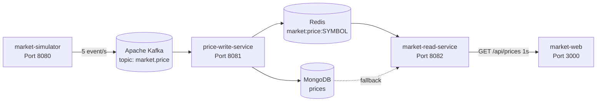

# 🚀 Kafka & Redis Microservices Realtime Market Architecture

Hệ thống theo dõi và phân phối dữ liệu thị trường tiền mã hóa theo thời gian thực (Binance / TradingView Terminal Style) ứng dụng kiến trúc hướng sự kiện (Event-Driven) với Kafka, Redis Cache, MongoDB và Spring Boot Microservices.

---

## 🏛️ Sơ đồ Luồng Dữ liệu (Data Pipeline)



---

## 📦 Danh sách các thành phần đã đóng gói Docker

| Service | Vai trò | Cổng Container | Cổng Host |
|---|---|---|---|
| **kafka** | Cụm Message Broker (KRaft mode) | 29092, 9092 | `9092` |
| **redis** | In-memory Cache snapshot giá (TTL 30s) | 6379 | `6379` |
| **mongodb** | Cơ sở dữ liệu lưu trữ lịch sử | 27017 | `27017` |
| **market-simulator** | Spring Boot Producer sinh ngẫu nhiên giá 5 coin | 8080 | `8080` |
| **price-write-service** | Spring Boot Consumer ghi DB & Redis cache | 8081 | `8081` |
| **market-read-service** | Spring Boot REST API đọc giá từ Redis/Mongo | 8082 | `8082` |
| **market-web** | React 19 Frontend Web Dashboard (Nginx) | 80 | `3000` |

---

## ⚡ Hướng dẫn Khởi chạy bằng Docker Compose

### 1. Yêu cầu tiên quyết
- Đã cài đặt và bật **Docker Desktop** (hoặc Docker Engine).

### 2. Cấu hình biến môi trường

Sao chép `.env.example` thành `.env`, sau đó thay `change-me` bằng mật khẩu MongoDB dùng cho máy của bạn.

### 3. Khởi chạy toàn bộ hệ thống bằng 1 lệnh duy nhất:

Tại thư mục gốc của dự án:

```bash
docker compose up -d --build
```

Lệnh này sẽ tự động:
1. Kéo image Kafka, Redis, MongoDB và khởi động các container hạ tầng.
2. Build 3 service Spring Boot (Java 17) qua multi-stage Dockerfile.
3. Build frontend React và cấu hình Nginx.
4. Nối tất cả các dịch vụ vào cùng mạng `bridge` nội bộ.

### 4. Kiểm tra trạng thái:

```bash
docker compose ps
```

### 5. Truy cập dịch vụ:

- 📊 **Web Dashboard:** [http://localhost:3000](http://localhost:3000)
- 🔌 **API lấy danh sách giá:** [http://localhost:8082/api/prices](http://localhost:8082/api/prices)
- 🔌 **API lấy một cặp coin:** [http://localhost:8082/api/prices/BTC/USDT](http://localhost:8082/api/prices/BTC/USDT)
- 🔌 **API SSE Streaming:** [http://localhost:8082/api/prices/stream](http://localhost:8082/api/prices/stream)

### 6. Dừng hệ thống:

```bash
docker compose down
```

---

## 💻 Chạy ở Môi trường Phát triển (Local Dev)

Nếu bạn muốn chạy và debug code trong IDE:

1. **Bật hạ tầng (Kafka, Redis, Mongo):**
   ```bash
   docker compose up -d kafka redis mongodb
   ```
2. **Chạy từng service Spring Boot** trực tiếp từ IntelliJ IDEA hoặc `./mvnw spring-boot:run`.
3. **Chạy Frontend:**
   ```bash
   cd market-web
   npm install
   npm run dev
   ```
   Truy cập tại: [http://localhost:3000](http://localhost:3000) (tự động proxy `/api` sang `http://localhost:8082`).
